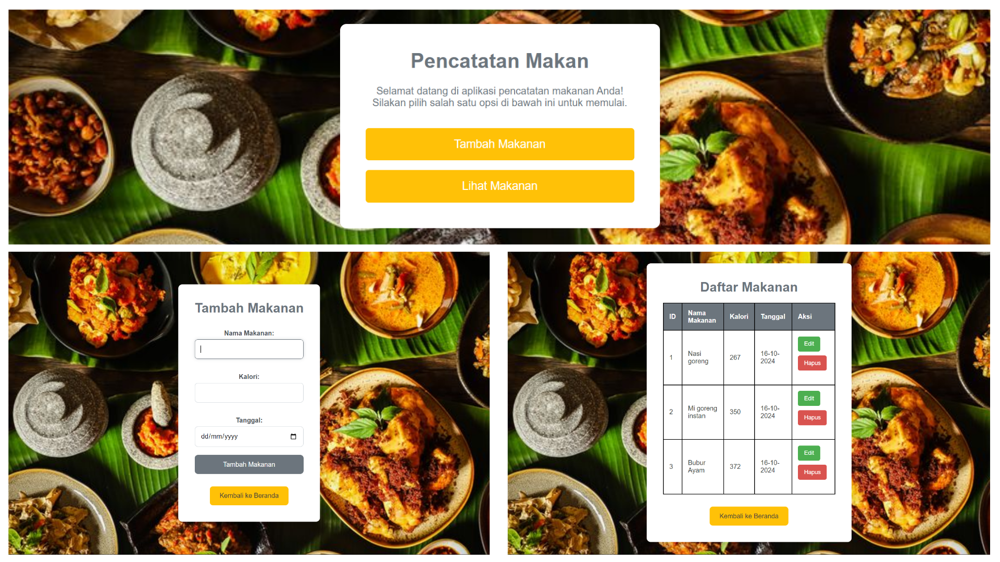

# Aplikasi Manajemen Makanan

Aplikasi Manajemen Makanan adalah aplikasi sederhana untuk mencatat dan mengelola informasi tentang makanan, termasuk nama makanan, lokasi tempat makan, dan tanggal.

## Fitur

- Tambah makanan baru dengan informasi nama, lokasi, dan tanggal.
- Edit informasi makanan yang sudah ada.
- Hapus makanan dari daftar.
- Tampilkan daftar makanan yang telah ditambahkan.
- Menggunakan database SQLite untuk penyimpanan data.

## Lampiran


## Teknologi yang Digunakan
- **HTML**: Untuk struktur halaman web.
- **CSS**: Untuk desain dan tata letak.
- **PHP**: Untuk pengolahan data dan interaksi dengan database.
- **SQLite**: Untuk penyimpanan data lokal.

## Instalasi

1. Clone repositori ini ke mesin lokal Anda:

   ```bash
   git clone https://github.com/username/repo-name.git
